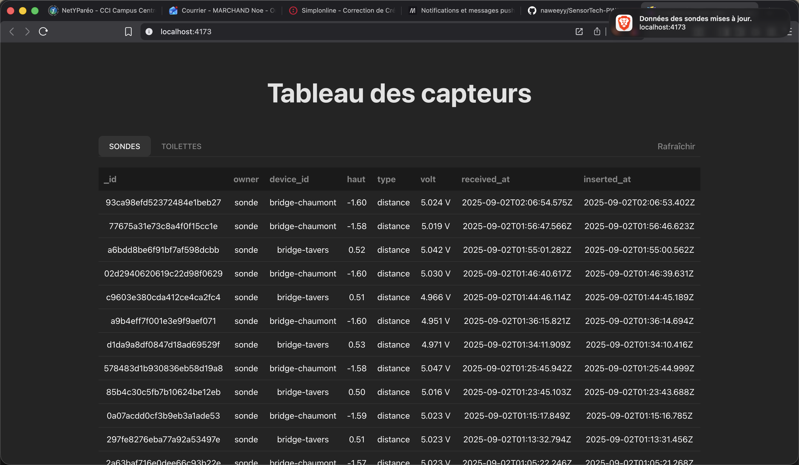
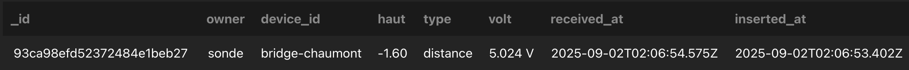
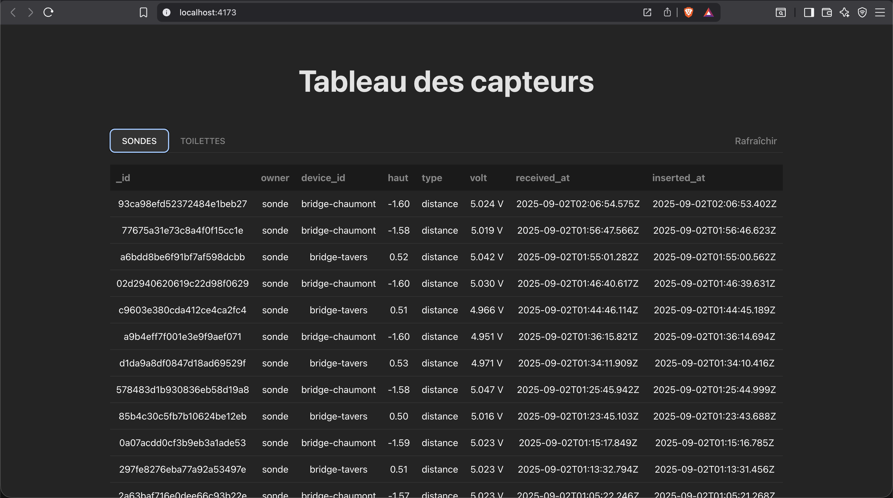
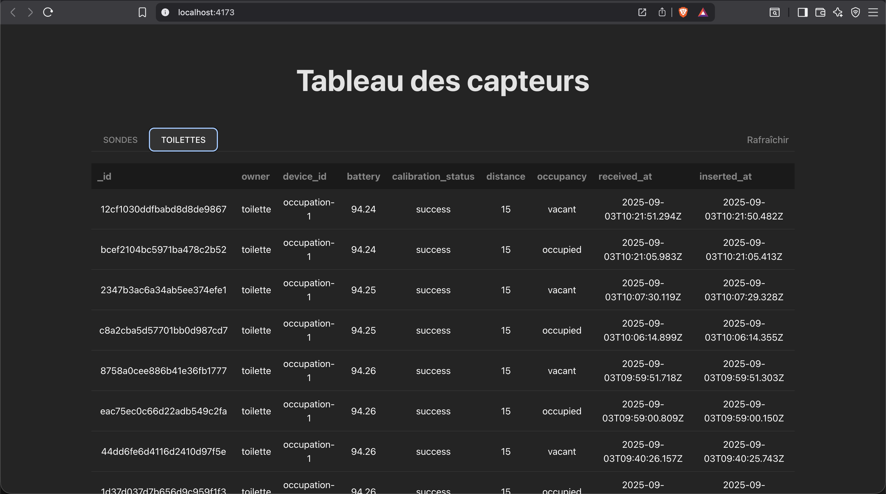
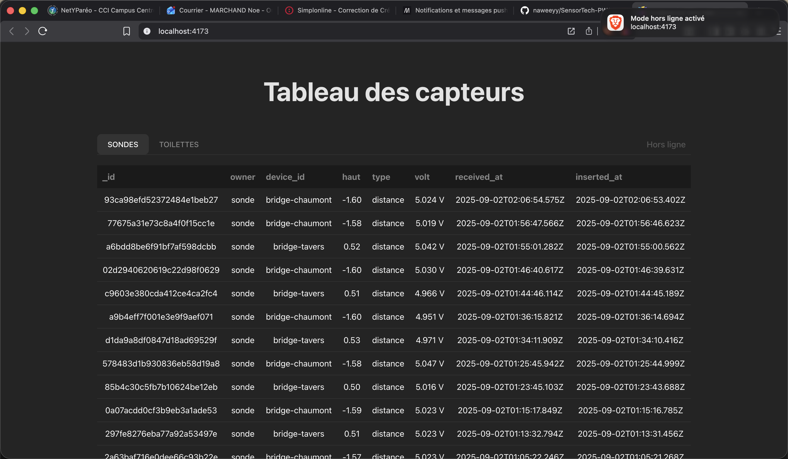

# Objectifs

> Développer une Progressive Web App (**PWA**) pour la gestion et l'affichage des données de capteurs, avec support offline et notifications.

# Les différentes étapes avec le temps passé pour chacune

1. Initialisation du projet et configuration Vite + React: **`30min`**
2. Mise en place du manifeste PWA et Vite PWA **`1h`**`
3. Implémentation du composant `Tableau.tsx` **`1h30`**
4. Gestion du cache et service worker **`2h`**
5. Notifications et UX offline **`45mins`**
6. Tests, build et corrections **`2h`**

# Les captures d'écrans

> Fetch données API

> Données d'une sonde

> Affichage des différentes données des Tabs

> Passage de l'application hors-ligne/en ligne

# Axe d'amélioration

- Simplifier la gestion du cache en s'appuyant uniquement sur Workbox/Vite PWA.
- Ajouter des tests end-to-end pour vérifier le comportement offline.
- Améliorer l'UX des notifications (utiliser Service Worker pour push en arrière-plan).
- Ajouter des métriques de synchronisation et d'invalidation de cache.

# Difficultés rencontrées

- Comprendre les interactions entre le cache côté page et Workbox.
- Mise en place correcte du service worker en environnement de développement.
- Gestion des permissions de notification et compatibilités navigateur.

# Conclusion

> Ce projet m'a beaucoup appris, malgré les galères avec les service workers, ça fonctionne correctement !
